# Topic 到展示卡片的业务类图

这张图用业务视角描述 Recall 里一条 `topic` 从进入系统，到变成最终可展示卡片的主链路。

```mermaid
classDiagram
direction LR

class Topic["选题 Topic"] {
  +业务输入：想研究的话题
  +示例：CrewAI MCP Servers
  +目标：沉淀成可复习卡片
}

class CaptureJob["采集任务 CaptureJob"] {
  +状态：检索 / 读取 / 抽题 / 分类 / 入库
  +searchLimit：最多找多少信源
  +readConcurrency：同时读取多少网页
}

class Source["素材来源 Source"] {
  +title：来源标题
  +url：来源链接
  +status：待读取 / 抽取中 / 完成
}

class QuestionDraft["候选卡片 QuestionDraft"] {
  +statement：题目
  +summary：标准答案摘要
  +evidenceQuote：证据原文
  +confidence：可信度
}

class TaxonomyPlan["分类方案 TaxonomyPlan"] {
  +作用：给这一批题目规划分类树
}

class TagPath["标签路径 TagPath"] {
  +level1：一级主题
  +level2：二级主题
  +level3：三级主题
}

class StudyCard["正式卡片 StudyCard"] {
  +statement：最终展示题目
  +answer：最终答案
  +explanation：解释说明
  +embedding：检索向量
}

class KnowledgeRepository["知识仓库 KnowledgeRepository"] {
  +taxonomy：分类树
  +truths：正式卡片
}

class RepositorySnapshot["展示快照 RepositorySnapshot"] {
  +summary：仓库统计
  +taxonomy：树形目录
  +truths：卡片列表
}

class DisplayCard["展示卡片 DisplayCard"] {
  +title：前端显示标题
  +answer：详情区标准答案
  +sourceLink：原始来源链接
}

Topic "1" --> "1" CaptureJob : 发起采集
CaptureJob "1" --> "0..*" Source : 检索并缓存信源
Source "1" --> "0..*" QuestionDraft : 抽取候选题目
CaptureJob "1" --> "1" TaxonomyPlan : 规划分类
TaxonomyPlan "1" --> "1..*" TagPath : 生成三级标签路径
QuestionDraft "0..*" --> "1" TagPath : 绑定到唯一分类
QuestionDraft "1" --> "0..1" StudyCard : 去重 + 向量化后转正
StudyCard "0..*" --> "1" KnowledgeRepository : 写入知识仓库
TaxonomyPlan "1" --> "1" KnowledgeRepository : 同步分类树
KnowledgeRepository "1" --> "1" RepositorySnapshot : 生成前端读取快照
RepositorySnapshot "1" --> "0..*" DisplayCard : 渲染列表与详情
DisplayCard "0..*" --> "1" StudyCard : 展示正式卡片

note for CaptureJob "主流程：检索信源 -> 读取正文 -> 抽取题目 -> 规划分类 -> 题目绑定 -> 向量化 -> 入库"
note for DisplayCard "业务经理可以把它理解成：用户最终在仓库里看到的那张卡片"
```

业务上可以这样理解：

- `Topic` 是业务想研究的主题，进入系统后先变成一条 `CaptureJob`
- `CaptureJob` 会去找外部 `Source`，再从每个来源抽出 `QuestionDraft`
- 系统会基于整批题目生成 `TaxonomyPlan`，并给每张候选卡片绑定一个 `TagPath`
- 绑定完成的候选卡片经过去重、向量化后，升级成正式的 `StudyCard`
- `StudyCard` 和分类树一起进入 `KnowledgeRepository`
- 前端从仓库生成 `RepositorySnapshot`，最后渲染成业务上能直接看到的 `DisplayCard`
